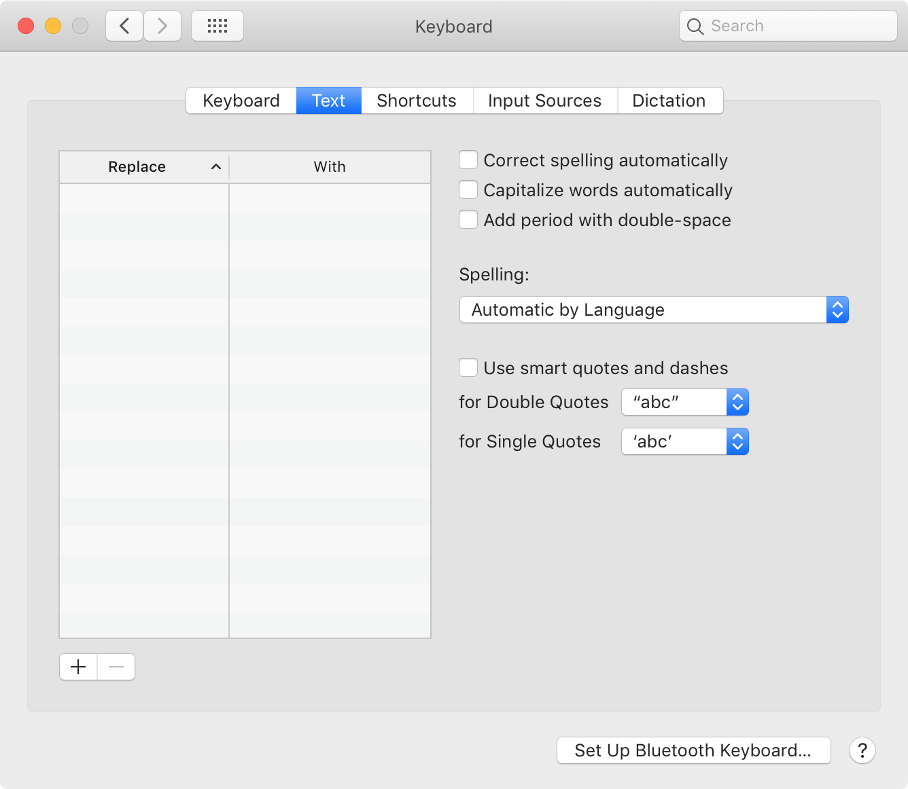
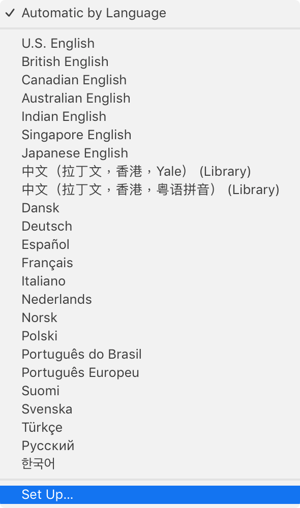
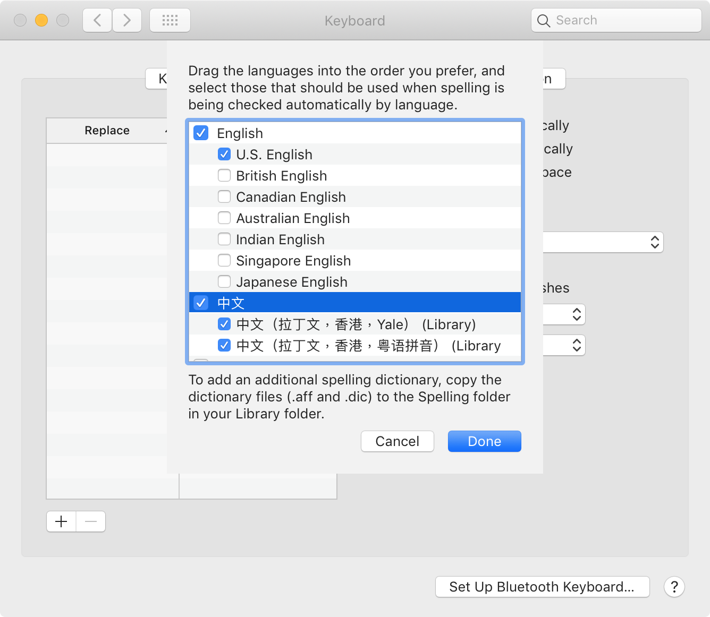

# Cantonese Romanization Spellcheck

Check for errors in your romanizations of Cantonese.

## Usage

These two Hunspell dictionaries work with any spellchecker that supports the Hunspell dictionary format: `.aff` and `.dic`.

### macOS

To install in macOS,

1. Place the `.aff` and `.dic` files from this repository in `~/Library/Spelling/`.
2. Open System Preferences > Keyboard > Text.
  
3. Open the "Spelling" menu. Select "Set Up...".
  
4. Toggle on the romanization spellcheckers you wish to use and drag to reorder the languages into the order you prefer. Press "Done".
  

## Limitations

1. It does not contain an actual word list. Any series of valid romanizations will pass—even if it is nonsense or a particular syllable/tone that is unused in Cantonese.
2. These dictionaries operate in a "most-permissive" manner. This makes "aaaaaaa" a valid Yale romanization (for "啊啊啊啊啊啊啊").
3. It does not in any way enforce spacing. "Hēung Góng" and "Hēunggóng" are both valid.

## Known Issues

1. [macOS Uses Simplified Characters for label.](rdar://problem/FB8295758)
2. [macOS "Automatic by Language" spellchecking does not smartly detect language with user-supplied dictionaries.](rdar://problem/FB8296426)

## License

Licensed under the [AGPL 3.0](https://www.gnu.org/licenses/agpl-3.0.html).